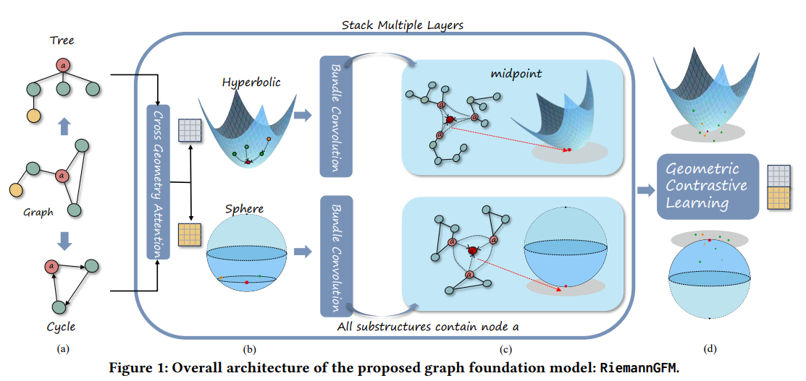
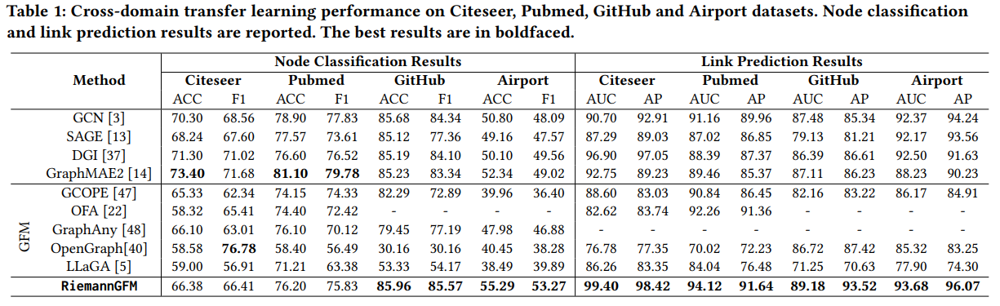
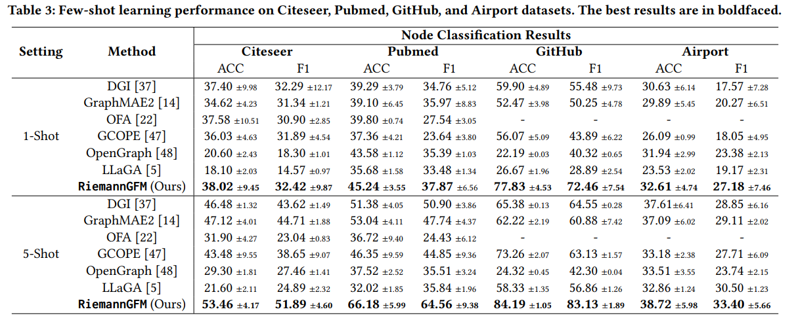

# RiemannGFM

## Get Started
First, install all the required pakages using
```shell
pip install -r requirements.txt
```

You need to **Pretrain model** before you start downstream tasks.

```shell
source ./scripts/pretrain.sh
```

The model you trained will be saved to directory ```./checkpoints/```.

If you want to define a custom name of saved model file, 
you can change the param ```--pretrained_model_path``` . 

If you want to pretrain on other datasets, 
you can change the param ```--pretrain_datasets```.

For the downstream tasks, if you want to run node classification, 
for example, you can use
```shell
source ./scripts/NC/github.sh
```

For Link Prediction task, you can run
```shell
source ./scripts/LP/citeseer.sh
```

If you do not want to load pretrained model for downstream tasks,
you can add ```--load``` to bash script.

If you do not want to fine-tune pretrained model weights during 
training on downstream tasks,
you can add ```--finetune``` to bash script.

## Model Architecture


## Experimental Results


